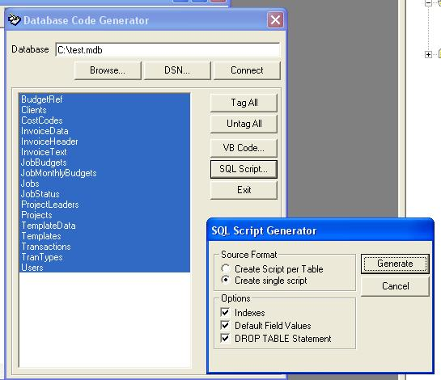



## DBCode

### Description

This utility is used to script a database.

You can generate SQL Script for Query Analyser which is useful for migrating a JET (Access) database to SQL Server.

You can also generate VB Source code to create a target database via DAO objects or DAO SQL Execute statements.

I wrote this VERY quickly a few years back for a SQL migration project. I will update for ADO if anyone interested!
 
### More Info
 

             |
---                |---
**Submitted On**   |2003-12-18 11:27:20
**By**             |[Richard Mewett](https://github.com/Planet-Source-Code/PSCIndex/blob/master/ByAuthor/richard-mewett.md)
**Level**          |Intermediate
**User Rating**    |4.7 (33 globes from 7 users)
**Compatibility**  |VB 4\.0 \(32\-bit\), VB 5\.0, VB 6\.0
**Category**       |[Complete Applications](https://github.com/Planet-Source-Code/PSCIndex/blob/master/ByCategory/complete-applications__1-27.md)
**World**          |[Visual Basic](https://github.com/Planet-Source-Code/PSCIndex/blob/master/ByWorld/visual-basic.md)
**Archive File**   |[DBCode1780938122004\.zip](https://github.com/Planet-Source-Code/richard-mewett-dbcode__1-55517/archive/master.zip)

